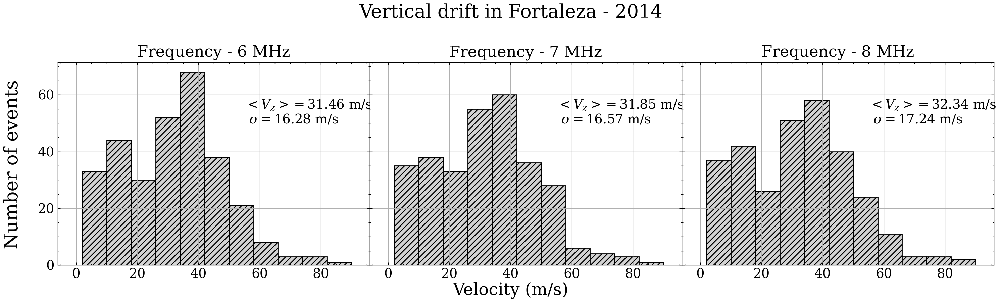

# IONOSONDE DATA ANALYSIS

This repository contains the ionosonde data analysis from 
[EMBRACE](http://www2.inpe.br/climaespacial/portal/en/) database. 


But first, it is necessary to pre-process the raw data (ionograms) using 
the SAO explorer program, which is manual processing most of the time and 
often requires a lot of technique and experience from the user in each type 
of ionogram configuration. For example, during the occurence of Equatorial 
Spread F (ESF), which is most often associated with the occurrence of EPBs, 
compromise significantly the visualization of ionograms due the presence
of diffuse traces that may appear in frequency and/or height.

Therefore, this directory is intended only for the data product already 
processed by SAO Explorer. Which is made the analysis of the real 
height of the ionospheric F layer for each frequency that can vary from 2 to 
12 MHz.

## Histograms

[Plotting histograms](https://github.com/LuizFillip/IonosondeAnalysis/blob/main/plotHistogram.py) 
or see the distribution frequency of the parameters (velocity, height or time). 

```

infile = "directory-with-ionosonde-files/"
filename = "one-single-file.txt"

plotHistogram(infile, 
              filename, 
              year = year,
              site = site, 
              parameter = "peak", 
              binwidth = 8,
              save = True)

```

