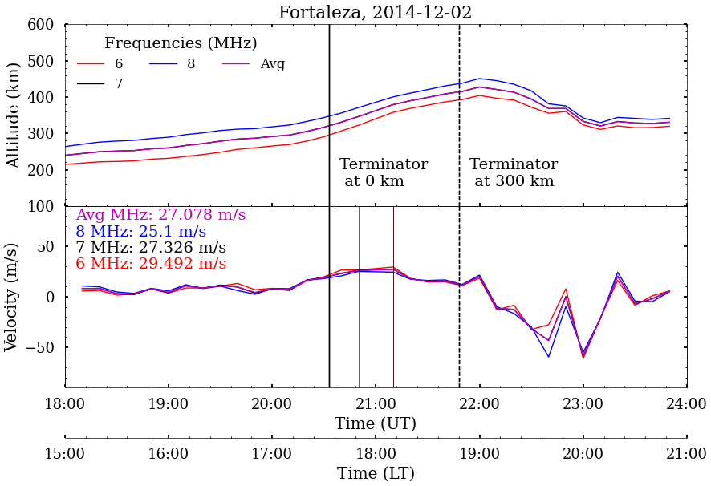

# IONOSONDE DATA ANALYSIS

This repository contains the ionosonde data analysis from 
[EMBRACE](http://www2.inpe.br/climaespacial/portal/en/) database. 

## About

But first, it is necessary to pre-process the raw data (ionograms) using 
the SAO explorer program, which is manual processing most of the time and 
often requires a lot of technique and experience from the user in each type 
of ionogram configuration. For example, during the occurence of Equatorial 
Spread F (ESF), which is most often associated with the occurrence of EPBs, 
compromise significantly the visualization of ionograms due the presence
of diffuse traces that may appear in frequency and/or height.

Therefore, this directory will intended shows the data analysis only 
product already processed by SAO Explorer. Which is made the analysis of the real 
height of the ionospheric F layer for each frequency that can vary from 2 to 
12 MHz.

The data file name is STN_YYYYMMDD.RSF (or STN_YYYYMMDD.GRM) and STN_YYYYMMDD.SAO, where:

STN: station label (5 digits (letters and numbers))
YYYY: year (4 digits)
MM:   month (2 digits)
DD:   day  (2 digits)


Station coordinates:
longitude	latitude	station
-48.5013	-1.4563	        BLJ03  (Belem)
-44.2097        -2.5941         SAA0K  (São Luis)
-38.5270        -3.7327         FZA0M  (Fortaleza)
-60.7109	 2.8701	        BVJ03  (Boa Vista) 
 54.6218        -20.4649        CGK21  (Campo Grande)
-45.0093	-22.7038	CAJ2M  (Cachoeira Paulista)
-53.8043	-29.6897	SMK29  (Santa Maria)       


## 

## Histograms

[Plotting histograms](https://github.com/LuizFillip/IonosondeAnalysis/blob/main/plotHistogram.py) 
or see the distribution frequency of the parameters (velocity, height or time). 

```

import matplotlib.pyplot as plt
import os
from pipeline import *
import config

infile = "directory-with-all-ionosonde-files/"
filename = "one-single-file.txt"

plotHistogram(infile, 
              filename, 
              year = year,
              site = site, 
              parameter = "peak", 
              binwidth = 8,
              save = True)

```


## Vertical drift and real height

[Plotting vertical drift and real height](https://github.com/LuizFillip/IonosondeAnalysis/blob/main/plotVerticaldrift.py)
for real height (and your averages) in the upper panel and vertical drift by 
d h'F/dt in the lower panel. 


```
infile = "directory-with-all-ionosonde-files/"
filename = "one-single-file.txt"


plotVerticaldrift(infile, filename, 
                  day = 2, save = True)
                  
```

